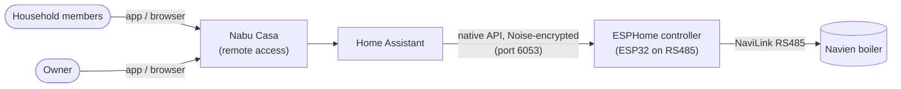
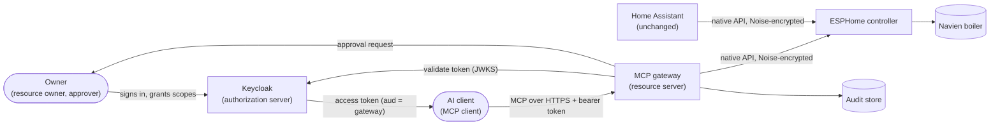
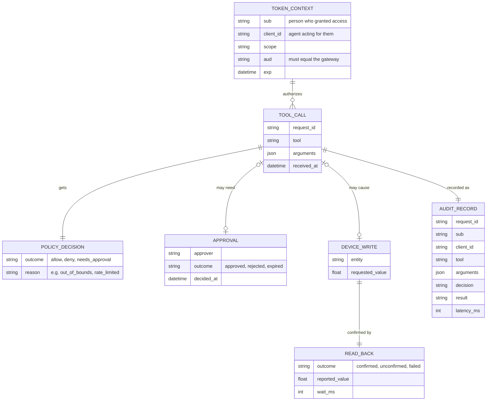
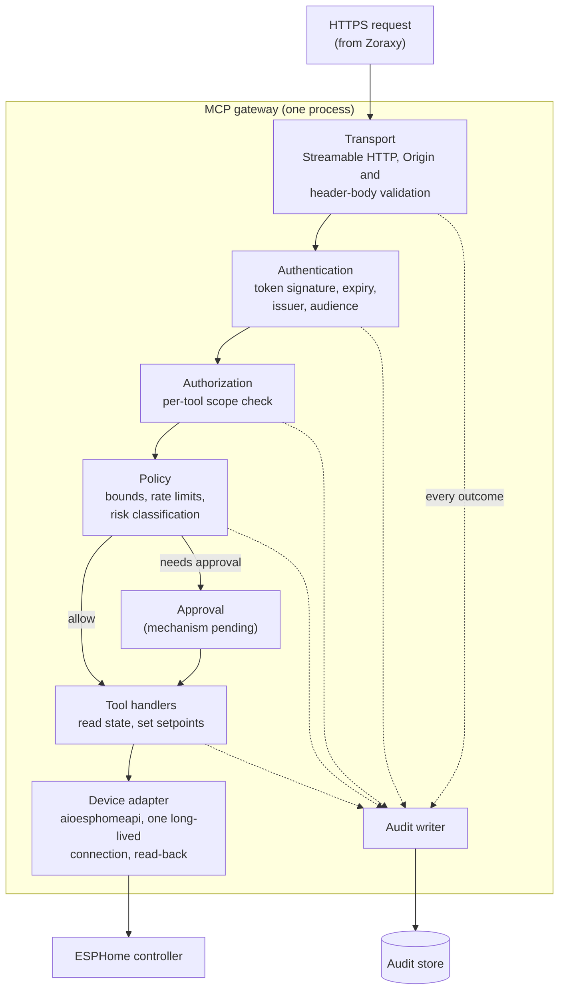
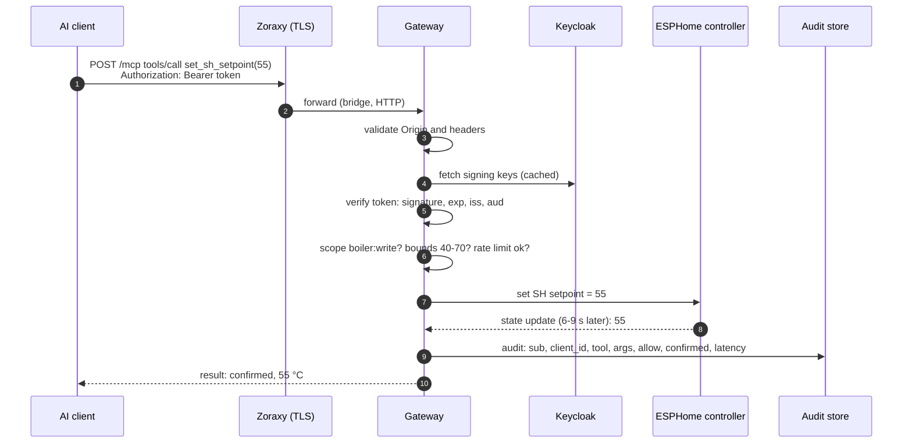
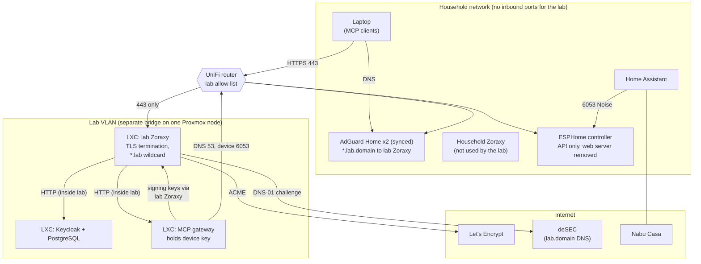

# Baseline and target architecture

ADM phases: B (Business), C (Data and Application) and D (Technology), combined. Status: draft.

This document describes the system as it is (baseline) and as it will be (target), and lists the gaps between them. It builds on the [principles](00-principles.md), the [vision](01-vision.md) and ADRs [0001](../adr/0001-remove-device-web-server.md) to [0006](../adr/0006-hosting-and-tls.md). Hostnames are written as `lab.<domain>`.

## Baseline

Today, Home Assistant is the only system that talks to the boiler's controller. The controller's unauthenticated web server was removed in ADR 0001, so the native API is the only network path to the device.

Baseline characteristics:

- One client of the device (Home Assistant), holding the device's encryption key.
- No AI access. No audit of who changed a setting, other than Home Assistant's own history.
- Device-side limits only: the firmware accepts setpoints from 40 to 82 °C.

## Target

The gateway adds a second, governed path for AI clients. Home Assistant's path is unchanged (P9).

## Phase B: Business architecture

Kept deliberately thin: one household, one device.

### Actors and roles

| Actor | Role in the target |
|---|---|
| Owner | Resource owner: grants scopes to AI clients in Keycloak, approves high-risk actions, reviews the audit trail |
| AI client | Acts for the owner within granted scopes. Cannot approve its own high-risk requests |
| Household members | Use heat and hot water. Affected by changes; do not use the gateway |
| Home Assistant | Existing automation and UI. Keeps its own direct path |
| Service technician | Needs device settings and error history to be explainable from records |

### Business services

| Service | Scope needed | Policy |
|---|---|---|
| Read boiler state | `boiler:read` | Always allowed with a valid token |
| Change space-heating setpoint | `boiler:write` | Gateway bounds 40–70 °C, rate limit, read-back |
| Change hot-water tank setpoint | `boiler:write` | Gateway bounds 40–60 °C, rate limit, read-back |
| High-risk actions (power, recirculation, hot button) | `boiler:write` | Human approval before reaching the device (P4) |
| Review audit trail | Owner only | Read-only |

## Phase C: Data architecture

### Main data entities

### Data classification

| Data | Class | Where it lives | Rule |
|---|---|---|---|
| Device encryption key | Secret | Gateway container only (environment or secret store) | Never logged or returned (P6) |
| Access tokens | Secret, short-lived (5 min) | In transit only | Never logged; never passed on (ADR 0004) |
| Keycloak signing keys, admin credentials | Secret | Keycloak container | Not reachable from the gateway |
| Audit records | Internal | SQLite in the gateway container (ADR 0007) | Hold `sub` and `client_id`, never tokens. Audit failure blocks writes (P5) |
| Boiler telemetry | Internal | Read live from the device | Not persisted by the gateway beyond audit context |

## Phase C: Application architecture

### Gateway components

Every request passes through the same pipeline. No tool handler can be reached without passing authentication, authorization and policy, and every outcome, including denials, is written to the audit store.

The device adapter sits behind its own interface so it can later become a separate service (ADR 0002, option 3).

### A setpoint change, end to end

If any check fails, the gateway stops at that step, writes an audit record with the reason, and returns the matching error: 401 for a missing or invalid token, 403 `insufficient_scope` for a missing scope, or a tool error for a policy denial. If the device does not report the new value within the timeout, the result is `unconfirmed`, never `confirmed` (P2).

### Interfaces

| Interface | Protocol | Authentication |
|---|---|---|
| AI client to gateway | MCP Streamable HTTP over HTTPS (spec 2026-07-28) | OAuth 2.1 bearer token, audience-bound |
| AI client to Keycloak | OAuth 2.1 authorization code with PKCE | Owner signs in; pre-registered public client |
| Gateway to Keycloak | HTTPS (discovery, signing keys) | None needed (public metadata) |
| Gateway to device | ESPHome native API | Noise pre-shared key |
| Gateway to owner (approval) | Pending | Pending |

## Phase D: Technology architecture

### Deployment

### Network flows

Every flow between the lab VLAN and the household network crosses the router, which allows only the flows marked "router" below and blocks the rest. Flows inside the lab VLAN do not reach the router and are not filtered.

| From | To | Port | Purpose |
|---|---|---|---|
| MCP client (household) | Lab Zoraxy | 443 | MCP calls; Keycloak sign-in (router) |
| Owner's admin machine | Lab Zoraxy | admin port | Proxy configuration (router) |
| Lab Zoraxy | Keycloak LXC | 8080 | Proxied Keycloak (inside lab) |
| Lab Zoraxy | Gateway LXC | to be set | Proxied MCP endpoint (inside lab) |
| Lab VLAN | AdGuard Home | 53 | Name resolution (router) |
| Gateway LXC | Lab Zoraxy | 443 | Keycloak discovery and signing keys, using the public HTTPS name so the issuer matches (inside lab) |
| Gateway LXC | ESPHome controller | 6053 | Native API (Noise); the only lab-to-device flow (router) |
| Lab VLAN | Internet | 443 | Package and image updates (router) |
| Home Assistant | ESPHome controller | 6053 | Unchanged |
| Lab Zoraxy | deSEC, Let's Encrypt | 443 | Certificate issuance and renewal only (router) |

The ESPHome native API allows several clients at once (`max_connections` defaults to 5 on ESP32), so the gateway and Home Assistant can both stay connected.

## Gap analysis

| Gap (baseline to target) | Addressed by | Status |
|---|---|---|
| Ungoverned direct path (web server) | ADR 0001 | Done |
| No identity for AI clients | ADR 0004, ADR 0005; Keycloak setup | Keycloak being installed |
| No TLS on the LAN for lab services | ADR 0006; deSEC, Zoraxy, AdGuard | Being set up |
| Lab work could affect household services | ADR 0006 (amended): lab VLAN, separate bridge, dedicated lab proxy, router rules | Being set up |
| No governed API for the device | Gateway, read-only first (P8) | Not started |
| No bounds stricter than the device | Gateway policy | Not started |
| No human approval for high-risk actions | Approval ADR | Decision open |
| No audit of AI actions | Audit writer; ADR 0007 | Decided; not built |
| No threat model | Threat model document and tests | Not started |

## Open items

- ADR on the approval mechanism.
- The gateway's port and canonical MCP address (`https://boiler.lab.<domain>/mcp`) are set during implementation.
- Roadmap of increments (phases E and F), starting with read-only tools.
