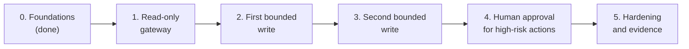

# Roadmap

ADM phases: E (Opportunities and Solutions) and F (Migration Planning), with G (Implementation Governance) as the exit check of each increment. Status: draft.

The target architecture ([02-baseline-target.md](02-baseline-target.md)) is reached in increments, following P8 (expose capability incrementally). Each increment is a working, safe state on its own. Capability is added one tool at a time, and nothing moves to the next increment until its compliance check passes.

## Increment 0: Foundations (done)

- Principles, vision, baseline and target architecture.
- ADRs 0001 to 0007: device web server removed, Python and the MCP SDK, Streamable HTTP, OAuth 2.1 resource server, Keycloak, lab hosting and TLS, audit store.
- Lab running: isolated lab VLAN with router rules, a dedicated lab reverse proxy with a trusted certificate, Keycloak with a dedicated realm.
- Verified: audience-bound tokens, unknown resources refused, minimal token claims ([ADR 0005, Verification](../adr/0005-keycloak-identity-provider.md#verification-2026-10-09)).

## Increment 1: Read-only gateway

Status: done 2026-10-09; [compliance check](../compliance/increment-1.md) passed.

**Goal:** an AI client can read the boiler's state through the gateway, and nothing else.

**Scope**

- MCP server over Streamable HTTP (spec 2026-07-28), with `Origin` and header-body validation (ADR 0003).
- Token validation on every request: signature against Keycloak's published keys, issuer, audience equal to the gateway's address, expiry. Fail closed if keys can't be fetched (ADR 0004).
- Protected Resource Metadata and the 401 challenge, so MCP clients can discover how to sign in.
- One read tool (boiler status: temperatures, setpoints, mode, burner level, error state), requiring `boiler:read`.
- Device adapter: one long-lived, encrypted connection to the device, behind its own interface (ADR 0002).
- Audit store: every call, allowed or denied, with the hash chain and a verification command (ADR 0007).
- Deployment: a gateway container on the lab VLAN, a route on the lab reverse proxy, and one router rule letting the gateway reach the device's API port (ADR 0006).

**Out of scope:** any write, approvals, OpenTelemetry.

**Threat model, first version:** stolen token, token for another audience, DNS rebinding, header-body mismatch, exhausting the device's connection slots, prompt injection that tries to make a read-only agent write.

**Exit criteria**

- At least one real MCP client connects through the full sign-in and reads the status. This tests the client-compatibility risk from ADR 0003.

**First client: Claude Code** (as an editor extension), registered in Keycloak as a pre-registered public client with PKCE S256 and a fixed loopback callback port. Checked 2026-10-09 against each tool's documentation:

- Claude Code negotiates MCP revision 2026-07-28 by default, accepts a pre-registered client ID with a fixed callback port, and starts discovery from Protected Resource Metadata.
- VS Code implements revision 2025-11-25, and support for 2026-07-28 is an open issue (`microsoft/vscode#329848`). Its open-source build, VSCodium, doesn't ship the built-in chat and MCP client at all. VS Code-family clients would need the gateway to also support 2025-11-25, which needs its own ADR.
- Unknown until tested: whether Claude Code sends the RFC 8707 `resource` parameter. If not, the fallback in ADR 0005 applies to that one client.
- Tests show a token without `boiler:read`, an expired token and a token for another audience are all refused, and each refusal is audited.
- The audit verification command reports an intact chain.
- Home Assistant still works unchanged (P9).

## Increment 2: First bounded write

Status: built and tested against a fake boiler (2026-10-09), [ADR 0008](../adr/0008-write-policy-for-bounded-setpoints.md); writes disabled in deployment until the first live write after the installer visit.

**Goal:** one setting can be changed within the gateway's limits, with read-back.

**Scope**

- One write tool: the hot-water tank setpoint, bounded to 40–60 °C by the gateway, independent of the device's own range (P3). Chosen first because its range is the narrowest and its effect is easy to observe.
- Requires `boiler:write`.
- Rate limit: one write per tool per 2 minutes. Rejected calls are audited.
- Audit before act: the decision is committed before the device is contacted; the outcome is a second record (ADR 0007).
- Read-back: the result is `confirmed`, `unconfirmed` or `failed`, based on what the device reports, never on what was sent (P2).
- Writes are never retried automatically (P7).

**Threat model additions:** excessive agency, a prompt-injected agent pushing values to the limits, rapid repeated writes, writes during a device fault.

**Exit criteria**

- Out-of-range values, rate-limited calls and calls without `boiler:write` are refused and audited, and nothing reaches the device.
- An in-range write is confirmed by read-back.
- Every value changed during testing is restored, and the restore is recorded.
- No write testing while a known device fault is under investigation.

## Increment 3: Second bounded write

**Goal:** generalize the policy layer with a second setting.

- Space-heating setpoint, bounded to 40–70 °C.
- Policy (bounds, rate limits, risk classification) becomes configuration under version control rather than code per tool.
- Note: if the boiler's outdoor reset curve is active, it can override the setpoint. The tool's result must say so rather than report success.

**Exit criteria:** as for increment 2, for the new tool. Policy changes are reviewed like code.

## Increment 4: Human approval for high-risk actions

**Goal:** actions that could cause harm or are hard to reverse wait for the owner (P4).

- An ADR on the approval mechanism comes first (the last open decision). Options include MCP elicitation through the client, an out-of-band notification to the owner's phone, or a separate approval page.
- Candidate actions: power, recirculation, hot button.
- No approval within the timeout means no action, and the expiry is audited.
- The approval records who approved and when, linked to the request.

**Exit criteria:** an agent cannot approve its own request; expired and rejected approvals leave the device untouched; every approval decision is audited.

## Increment 5: Hardening and evidence

- Off-box export of the audit chain's latest hash, so a rebuilt chain can be detected (ADR 0007).
- Requirements register: each requirement traced to a threat, a control, a test and a NIST AI RMF function.
- Threat model complete, with a test for each threat.
- Optional: OpenTelemetry traces alongside the audit store.
- A write-up of the project and its evidence.

## Implementation governance (phase G)

At the end of each increment, a short compliance check, recorded in the repository:

1. **Principles:** for each of P1 to P10, how the increment applies it, or which ADR records an exception.
2. **ADRs:** every decision made during the increment has an ADR.
3. **Tests:** every exit criterion has a passing test or recorded evidence.
4. **Threat model:** new threats are listed, with their controls and tests.
5. **Restore:** anything changed on the device during testing is back to its previous value.
6. **Secrets:** nothing secret in the repository, logs or audit records.

An increment that fails its check doesn't move forward until the gap is closed or an ADR accepts it.

## Risks across increments

| Risk | Where it bites | Mitigation |
|---|---|---|
| MCP clients don't yet support spec revision 2026-07-28 or its OAuth flow | Increment 1 exit | Test early with more than one client; decide in an ADR whether to support an earlier revision |
| Keycloak's resource-indicator feature changes in an upgrade | Any increment | Pinned version; the audience test from ADR 0005 runs after every upgrade |
| Device writes behave differently than documented | Increments 2 and 3 | Read-back on every write; one tool at a time; restore after tests |
| Scope grows faster than controls | All | No increment without its compliance check |
