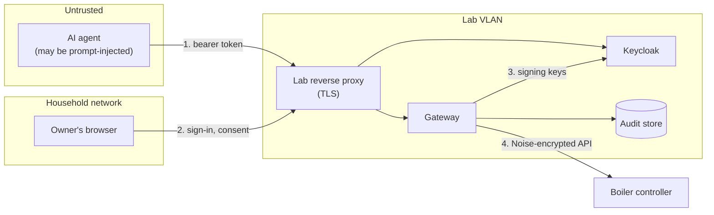

# Threat model

Version 2: increment 1 (read-only gateway, deployed) plus increment 2 (first bounded write, built and tested, writes disabled in deployment). Status: draft. Updated at the end of each increment as part of its compliance check ([roadmap, phase G](architecture/03-roadmap.md#implementation-governance-phase-g)).

Each threat lists its controls and the evidence that the controls work: an automated test, or a recorded check against the lab. Categories use STRIDE and, where the threat involves the AI agent, the OWASP Top 10 for LLM Applications (2025).

## Scope

In scope: the path from an MCP client to the boiler's controller through the gateway, the authorization server, the lab network and reverse proxy, and the audit store. Increment 1 exposes one read-only tool.

Out of scope for this version: threats that need write tools (increment 2 onwards) or approvals (increment 4). They are listed at the end so they aren't forgotten.

## What we protect

| Asset | Why it matters |
|---|---|
| The boiler and household safety | A gas appliance in an occupied house |
| Device encryption key | Anyone holding it can control the device directly, bypassing the gateway |
| Access tokens | Grant an agent the owner's permissions, for 5 minutes |
| Audit trail | The evidence of who did what; worthless if it can be altered or skipped |
| Household network | Lab work must not open a path into it |
| The owner's personal data | Name and email should not travel in tokens or tool output |

## Trust boundaries

Boundaries: (1) agent to gateway, where every request is authenticated, authorized and audited; (2) the owner's consent at the authorization server; (3) the gateway trusts Keycloak only for signing keys; (4) only the gateway, holding the device key, crosses into the device.

## Threats, controls and evidence

| ID | Threat | Category | Controls | Evidence | Status |
|---|---|---|---|---|---|
| T1 | A stolen access token is replayed | Spoofing | 5-minute token lifetime; tokens bound to this gateway only; read-only scope in this increment | `test_auth`: expired token refused; ADR 0005 verification: 300-second lifetime | Mitigated; replay within 5 minutes accepted |
| T2 | A token issued for another service is presented to the gateway (confused deputy) | Spoofing, Elevation | `aud` must equal the gateway's URL exactly and exclusively; SDK resource check as a second layer | `test_auth`: `wrong_audience`, `audience_not_exclusive`; `test_server`: wrong audience gets 401; live: Claude Code's first token (wrong audience) refused and audited | Mitigated |
| T3 | A forged token: unsigned, algorithm confusion, or signed by another key | Spoofing | Asymmetric algorithms only (symmetric can't be configured); key from the realm's published set; issuer check | `test_auth`: `alg=none`, HS256 confusion, wrong key, unknown key ID, wrong issuer | Mitigated |
| T4 | The authorization server issues tokens for unknown resources | Elevation | Keycloak resource indicators: unknown resources refused | ADR 0005 verification: `invalid_target` | Mitigated |
| T5 | A rogue client registers itself with the authorization server | Spoofing | Dynamic registration blocked by policy; clients pre-registered, public, PKCE S256 required, exact redirect URIs, consent required | ADR 0005 verification (by inspection) | Mitigated; not tested with a live request |
| T6 | The gateway passes a client's token on to another system | Elevation | No code path forwards tokens; the device uses its own key | Code review: `device.py` has no token input | Mitigated by design |
| T7 | A web page attacks the gateway through the browser (DNS rebinding) | Spoofing | `Host` and `Origin` allow-lists | `test_server`: bad origin, bad host | Mitigated |
| T8 | An intermediary and the gateway disagree about which tool is called (header-body mismatch) | Tampering | SDK rejects mismatched `Mcp-Method`/`Mcp-Name`; the policy check reads headers but can only deny | `test_server`: lying header gets 400 and no call | Mitigated |
| T9 | Excessive agency: the agent can do more than intended | Elevation; LLM06 | One read-only tool; unknown tools denied; per-tool scopes; the device adapter has no method that sends commands | `test_server`: tools list, unknown tool denied; `test_device`: no commands sent | Mitigated |
| T10 | Prompt injection steers the agent to change the boiler or extract data | Elevation; LLM01 | Nothing the agent can call changes the device (T9); output is typed values, not free text from external sources | As T9 | Mitigated for actions; misleading the agent's reasoning is out of the gateway's control |
| T11 | Sensitive information disclosed through tool output | Information disclosure; LLM02 | Curated status fields only; diagnostics (network addresses, firmware details, raw unknown values) never exposed; tokens carry no name or email | `test_server`: diagnostic value absent from output; ADR 0005 verification: minimal claims | Mitigated |
| T12 | Stale or misleading data presented as current | Repudiation; LLM09 | `device_connected` and `stale` flags; `last_reported` per value plus `device_connected_since`, so a reconnect isn't read as a change; outcome recorded as `unconfirmed` when disconnected | `test_server`: disconnected device reported stale, `last_reported` naming | Mitigated (incident 2026-10-09, see lessons) |
| T13 | Secrets leak: device key or tokens in logs, audit, errors or the repository | Information disclosure | Device key as a secret type; tokens never logged or recorded (only `jti`); credential-like tool arguments refused; `.env` gitignored | `test_config`: key absent from repr; `test_auth`: token absent from audit file; `test_audit`: credential-like arguments refused | Mitigated; see lessons below |
| T14 | The audit trail is edited or records removed | Tampering, Repudiation | Insert-only with triggers; SHA-256 hash chain; verification against an exported anchor | `test_audit`: edit, middle deletion, truncation with anchor | Partly: truncation is only caught with an off-box anchor (increment 5) |
| T15 | An action happens without being audited | Repudiation | Decision committed before acting; audit failure refuses the request (503) | `test_audit`: storage failure raises; `test_server`: every path audited | Mitigated |
| T16 | Someone bypasses the gateway and controls the device directly | Elevation | Device web server removed (ADR 0001); native API needs the device key; lab separated from the household network | Lab check: web port refused; ADR 0001 | Partly: Home Assistant holds the key by design (accepted second path) |
| T17 | A device on the network exhausts the controller's connection slots | Denial of service | The gateway uses one long-lived connection | Live check: one connection, reconnect logic | Accepted (owner decision, 2026-10-09): the controller is on the household network with many devices; a router rule between devices on the same network isn't straightforward there, and the impact is availability of reads, not control |
| T18 | The authorization server is unreachable or its keys can't be fetched | Denial of service | Fail closed: no valid keys, no access; keys cached for 5 minutes | `test_auth`: key server down, discovery issuer mismatch | Mitigated (availability traded for safety) |
| T19 | A compromised lab container reaches household services | Elevation | Lab VLAN with router allow-list; dedicated lab reverse proxy (no shared proxy to pivot through) | Lab checks: lab to Home Assistant and to household proxy blocked; household to Keycloak direct blocked | Mitigated |
| T20 | The reverse proxy exposes bearer tokens | Information disclosure | Lab-only proxy; request headers not logged; 5-minute tokens | Configuration (ADR 0006) | Accepted |
| T21 | Supply chain: a malicious or vulnerable dependency or install script | Tampering; LLM03 | Direct dependencies pinned, full lock file; install scripts read before running; Keycloak and proxy versions recorded | Reading the Keycloak script found a default admin password, fixed before use | Partly: no hash-pinned installs yet |
| T22 | The authorization server's experimental features change on upgrade | Elevation | Pinned Keycloak version; the audience test runs after every upgrade | `tools/oauth_pkce_check.py` | Mitigated by process |

## Increment 2: the first write

Threats added with the hot-water tank setpoint tool ([ADR 0008](adr/0008-write-policy-for-bounded-setpoints.md)). Evidence is `tests/test_writes.py`, `tests/test_policy.py` and the command tests in `tests/test_device.py`, run against a fake boiler. Live verification follows the installer visit.

| ID | Threat | Category | Controls | Evidence | Status |
|---|---|---|---|---|---|
| T23 | An agent, possibly prompt-injected, requests a value outside safe limits | Elevation; LLM06 | Gateway bounds 40 to 60 °C in 0.5 °C steps, independent of the device's 40 to 82 °C; NaN, infinity, booleans and strings refused | Out-of-range, off-step and invalid values never reach the device, each refusal audited | Mitigated |
| T24 | Rapid repeated writes (an agent looping, or pushing values back and forth) | Denial of service, Tampering; LLM06 | One write every 2 minutes per tool across all clients, derived from the audit trail | Second write refused; still refused after a restart; a no-change request doesn't consume the limit | Mitigated |
| T25 | A write reported as successful when the boiler never applied it | Repudiation; LLM09 | Read-back of the boiler's own reported setpoint; `confirmed`, `unconfirmed` or `failed`; never retried | Unconfirmed write reported as such and sent once; failed send reported | Mitigated |
| T26 | A write happens without an audit record | Repudiation | Policy decision committed before the command; audit failure means no command | Audit failure injected just before the command: nothing sent | Mitigated |
| T27 | A bug or injected call commands a high-risk entity (power, recirculation, hot button, restart) | Elevation | The adapter refuses any entity not on an explicit allow-list (one entity in this increment) | Command to main power refused by the adapter | Mitigated |
| T28 | Writes become available before the owner is ready, or during a device fault | Elevation | Kill switch, off by default; while off, the write tool isn't registered; live writes only after the installer visit, with the owner present | Tool absent and calls denied as `unknown_tool` when writes are off | Mitigated by design and process |
| T29 | An agent gains write permission without the owner noticing | Elevation | Separate `boiler:write` scope; a 403 challenge names it so the client must step up, and the owner approves it on the consent screen | Read-only token gets the `boiler:write` challenge; no command sent | Mitigated; live step-up not yet exercised |
| T30 | Two writes interleave and confuse read-back | Tampering | Writes serialized by a lock | By design | Mitigated |

## Lessons from building it

Real incidents during the build, kept because they show where controls failed or held:

- **Secrets in chat.** A Keycloak client secret was pasted in an export, and a DNS API token was pasted while debugging. Both were rotated immediately. Exports and debug output are a common leak path; the runbooks now say to redact before sharing.
- **A component wasn't where the plan said.** A container "moved" to the lab network was still on the household network. Block tests that expected `blocked` returned `OPEN`, which caught it. Tests that expect failure matter as much as tests that expect success.
- **Firewall rules saved as Block.** All allow rules were initially saved with the wrong action. Only the test that expected traffic to pass caught it; every "should be blocked" test passed.
- **A crash loop looked healthy.** After moving secrets out of a service file, Keycloak restarted 30 times while `is-active` reported `active`. The restart count showed it.
- **The gateway's own wording misled an agent.** The status tool called each timestamp `last_changed`, but ESPHome re-sends every value when a connection is made. An agent saw an error counter with a fresh timestamp and suggested a new boiler fault, when the count had been the same since the day before. Renamed to `last_reported`, with the connection time alongside. A tool's field names are part of what the model reasons over, so they need the same care as its access controls.
- **The real client didn't send `resource`.** The roadmap listed it as a risk to test rather than assume. The first token was refused for its audience, the fallback was applied to that client only, and the evidence is in the audit trail.
- **Install script defaults.** A community install script set a well-known bootstrap admin password. Reading scripts before running them is a cheap control that paid off.

## Deferred to later increments

| Threat | Increment |
|---|---|
| The same write threats for the space-heating setpoint, and policy moving into versioned configuration | 3 |
| An agent approving its own high-risk request; approval replay or expiry | 4 |
| Audit truncation without an off-box anchor | 5 |
| Mapping each threat and control to the NIST AI RMF | 5 |
